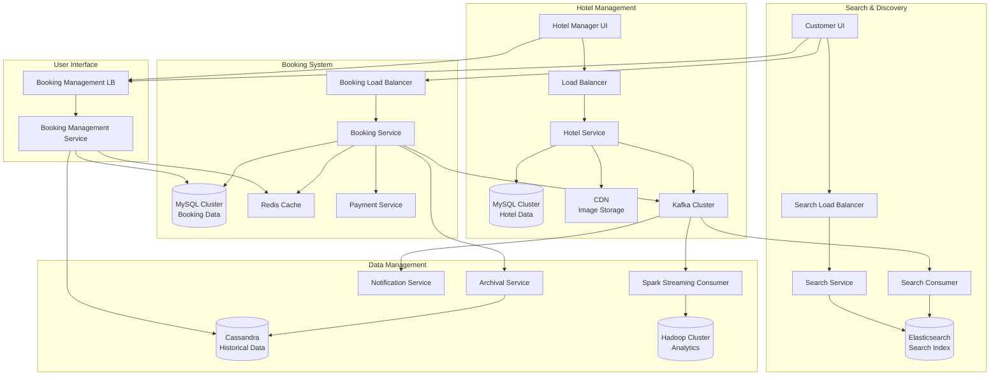
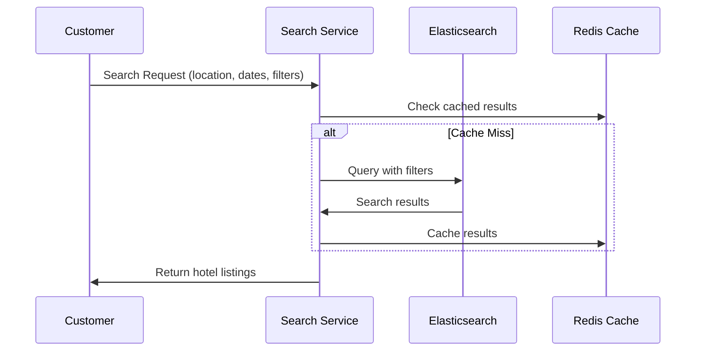
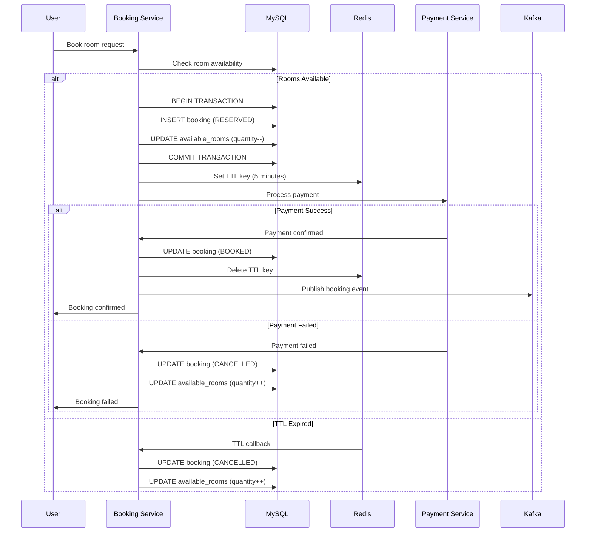
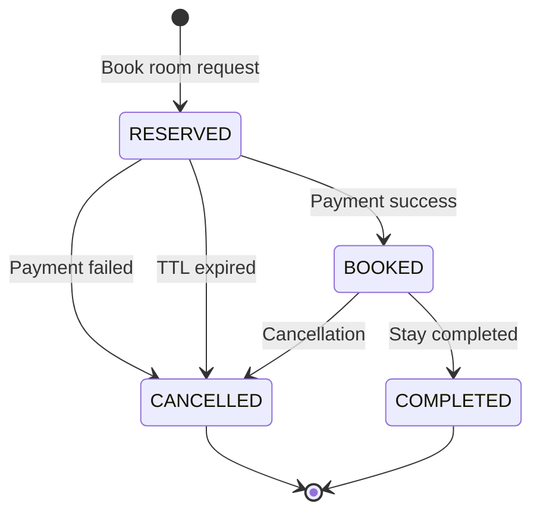
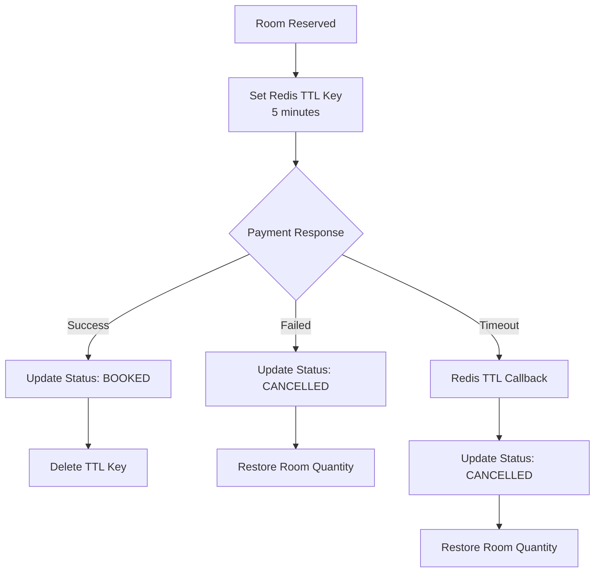
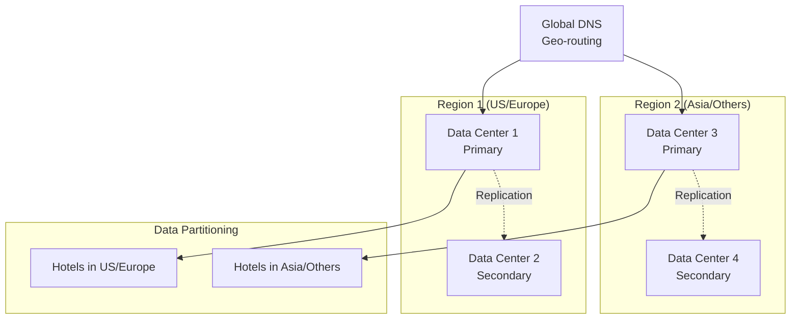
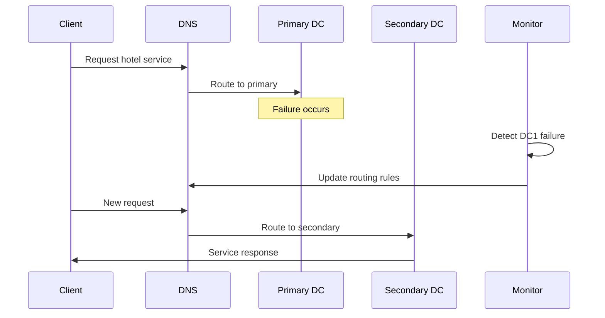

# Hotel Booking System - High Level Design

## Table of Contents
- [Overview](#overview)
- [Requirements](#requirements)
- [System Scale](#system-scale)
- [High-Level Architecture](#high-level-architecture)
- [Component Deep Dive](#component-deep-dive)
- [Database Design](#database-design)
- [Booking Flow](#booking-flow)
- [Geographic Distribution](#geographic-distribution)
- [Monitoring and Alerting](#monitoring-and-alerting)
- [Alternative Design Choices](#alternative-design-choices)

## Overview

This document outlines the high-level design for a hotel booking system similar to Booking.com or Airbnb. The system supports hotel management, property search, and booking functionality with high availability and low latency requirements.

## Requirements

### Functional Requirements

#### Hotel Manager Features
1. **Hotel Onboarding**: Ability to register and onboard properties onto the platform
2. **Property Management**: Update hotel information, add rooms, modify pricing, upload images
3. **Booking Management**: View bookings and revenue analytics

#### Customer Features
1. **Property Search**: Search hotels by location, date range, and filters (price, star rating, amenities)
2. **Hotel Booking**: Book selected properties with payment processing
3. **Booking Management**: View current and historical bookings

#### System Features
- **Analytics Support**: Infrastructure for business intelligence and reporting
- **Image Management**: CDN-based image storage and delivery

### Non-Functional Requirements
- **Low Latency**: Fast response times for search and booking operations
- **High Availability**: 99.9%+ uptime
- **High Consistency**: Immediate visibility of bookings across the system
- **Scalability**: Handle global scale with millions of users

## System Scale

### Current Market Statistics
- **Hotels Worldwide**: ~500,000 properties
- **Total Rooms**: ~10-12 million rooms globally
- **Average Hotel Size**: ~1,000 rooms per hotel
- **Booking Concurrency**: Low collision probability (max 2-3 users per room)

## High-Level Architecture



## Component Deep Dive

### Hotel Service Architecture

```mermaid
graph LR
    A[Hotel Manager] --> B[Hotel Service APIs]
    B --> C[MySQL Database]
    B --> D[CDN Storage]
    B --> E[Kafka Events]
    
    subgraph "Hotel Service APIs"
        F[POST /hotels]
        G[GET /hotel/{id}]
        H[PUT /hotel/{id}]
        I[PUT /hotel/{id}/room/{room_id}]
    end
```

### Search Flow



### Booking Flow with Concurrency Control



## Database Design

### Hotel Service Schema (MySQL)

```sql
-- Hotels table
CREATE TABLE hotels (
    id INT PRIMARY KEY AUTO_INCREMENT,
    name VARCHAR(255) NOT NULL,
    locality_id INT,
    description TEXT,
    original_images JSON,
    display_images JSON,
    is_active BOOLEAN DEFAULT TRUE,
    FOREIGN KEY (locality_id) REFERENCES locality(id)
);

-- Rooms table  
CREATE TABLE rooms (
    id INT PRIMARY KEY AUTO_INCREMENT,
    hotel_id INT NOT NULL,
    display_name VARCHAR(255),
    quantity INT NOT NULL,
    price_min DECIMAL(10,2),
    price_max DECIMAL(10,2),
    is_active BOOLEAN DEFAULT TRUE,
    FOREIGN KEY (hotel_id) REFERENCES hotels(id)
);

-- Facilities and mapping tables
CREATE TABLE facilities (
    id INT PRIMARY KEY AUTO_INCREMENT,
    name VARCHAR(255) NOT NULL,
    is_active BOOLEAN DEFAULT TRUE
);

CREATE TABLE hotel_facilities (
    hotel_id INT,
    facility_id INT,
    is_active BOOLEAN DEFAULT TRUE,
    PRIMARY KEY (hotel_id, facility_id)
);

CREATE TABLE room_facilities (
    room_id INT,
    facility_id INT,
    is_active BOOLEAN DEFAULT TRUE,
    PRIMARY KEY (room_id, facility_id)
);
```

### Booking Service Schema (MySQL)

```sql
-- Available rooms inventory
CREATE TABLE available_rooms (
    room_id INT,
    date DATE,
    initial_quantity INT NOT NULL,
    available_quantity INT NOT NULL CHECK (available_quantity >= 0),
    PRIMARY KEY (room_id, date)
);

-- Bookings table
CREATE TABLE bookings (
    booking_id VARCHAR(36) PRIMARY KEY,
    room_id INT NOT NULL,
    user_id INT NOT NULL,
    start_date DATE NOT NULL,
    end_date DATE NOT NULL,
    number_of_rooms INT NOT NULL,
    status ENUM('RESERVED', 'BOOKED', 'CANCELLED', 'COMPLETED') NOT NULL,
    invoice_id VARCHAR(255),
    created_at TIMESTAMP DEFAULT CURRENT_TIMESTAMP,
    updated_at TIMESTAMP DEFAULT CURRENT_TIMESTAMP ON UPDATE CURRENT_TIMESTAMP
);
```

### Cassandra Schema (Historical Data)

```cql
-- Bookings by user (partition key: user_id)
CREATE TABLE bookings_by_user (
    user_id INT,
    booking_id TEXT,
    hotel_id INT,
    room_id INT,
    start_date DATE,
    end_date DATE,
    status TEXT,
    PRIMARY KEY (user_id, booking_id)
);

-- Bookings by hotel (partition key: hotel_id)  
CREATE TABLE bookings_by_hotel (
    hotel_id INT,
    booking_id TEXT,
    user_id INT,
    room_id INT,
    start_date DATE,
    end_date DATE,
    status TEXT,
    PRIMARY KEY (hotel_id, booking_id)
);
```

## Booking Flow

### Room Reservation Process



### Concurrency Handling

The system uses MySQL's ACID properties to handle race conditions:

1. **Atomic Operations**: Room booking and inventory update in single transaction
2. **Consistency**: Check constraint prevents negative room quantities
3. **Isolation**: Transaction isolation prevents dirty reads
4. **Durability**: Committed transactions are persisted

### TTL-Based Reservation Management



## Geographic Distribution

### Multi-Region Architecture



### Failover Strategy



## Monitoring and Alerting

### Key Metrics Dashboard

```mermaid
graph TB
    subgraph "Application Metrics"
        AM1[Request Throughput]
        AM2[Response Latency P95/P99]
        AM3[Error Rates]
        AM4[Booking Success Rate]
        AM5[Search Performance]
    end
    
    subgraph "Infrastructure Metrics"
        IM1[CPU/Memory Usage]
        IM2[Database Performance]
        IM3[Cache Hit Ratio]
        IM4[Kafka Lag]
        IM5[Elasticsearch Query Time]
    end
    
    subgraph "Business Metrics"
        BM1[Popular Destinations]
        BM2[Revenue Analytics]
        BM3[Occupancy Rates]
        BM4[Customer Geography]
    end
    
    subgraph "Alerting System"
        ALERT1[PagerDuty/Slack]
        ALERT2[Grafana Dashboard]
        ALERT3[Auto-scaling Triggers]
    end
    
    AM3 --> ALERT1
    IM1 --> ALERT1
    IM2 --> ALERT1
    
    AM1 --> ALERT2
    AM2 --> ALERT2
    BM1 --> ALERT2
```



## Alternative Design Choices

### Database Alternatives

| Component | Current Choice | Alternatives | Rationale |
|-----------|---------------|--------------|-----------|
| **Hotel Data** | MySQL | PostgreSQL, SQL Server | ACID guarantees needed |
| **Booking Data** | MySQL | PostgreSQL | Transactions for concurrency |
| **Search Index** | Elasticsearch | Solr | Fuzzy search capabilities |
| **Cache** | Redis | Memcached | TTL callbacks, data structures |
| **Historical Data** | Cassandra | HBase | Operational simplicity |
| **Message Queue** | Kafka | RabbitMQ, ActiveMQ, SQS | Better scalability |

### Architectural Trade-offs

#### MySQL vs Cassandra for Bookings
- **MySQL Chosen**: ACID transactions, constraints, consistency
- **Cassandra Alternative**: Better horizontal scaling, eventual consistency

#### Synchronous vs Asynchronous Processing
- **Current**: Mixed approach (booking synchronous, analytics asynchronous)
- **Alternative**: Full async with eventual consistency

#### Monolithic vs Microservices
- **Current**: Service-oriented with clear boundaries
- **Alternative**: More granular microservices (room service, pricing service)

### Optimization Opportunities

1. **Caching Strategy**
    - Add Redis cache to Hotel Service for frequently accessed data
    - Implement CDN caching for search results

2. **Database Optimization**
    - Read replicas for Hotel MySQL
    - Partition Cassandra by time ranges
    - Elasticsearch index optimization

3. **Performance Enhancements**
    - Implement connection pooling
    - Use prepared statements
    - Add database query optimization

## API Design

### Hotel Management APIs
```http
POST /api/v1/hotels
GET /api/v1/hotels/{hotel_id}
PUT /api/v1/hotels/{hotel_id}
PUT /api/v1/hotels/{hotel_id}/rooms/{room_id}
DELETE /api/v1/hotels/{hotel_id}
```

### Search APIs
```http
GET /api/v1/search?location={location}&checkin={date}&checkout={date}&guests={count}
GET /api/v1/hotels/{hotel_id}/availability?checkin={date}&checkout={date}
```

### Booking APIs
```http
POST /api/v1/bookings
GET /api/v1/bookings/{booking_id}
PUT /api/v1/bookings/{booking_id}/cancel
GET /api/v1/users/{user_id}/bookings
```

## Security Considerations

- **Authentication**: JWT-based authentication for all APIs
- **Authorization**: Role-based access control (Hotel Manager, Customer, Admin)
- **Data Encryption**: TLS in transit, encryption at rest for sensitive data
- **Rate Limiting**: API rate limiting to prevent abuse
- **Input Validation**: Comprehensive input validation and sanitization

---

*This HLD provides a comprehensive foundation for building a scalable hotel booking system with high availability, low latency, and strong consistency guarantees.*