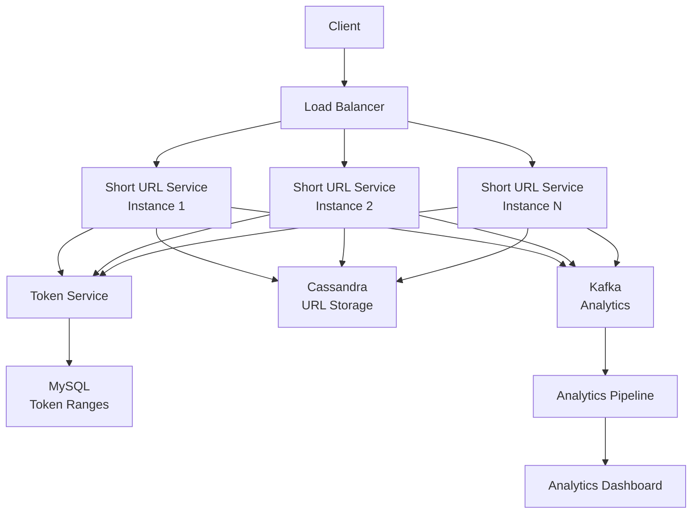
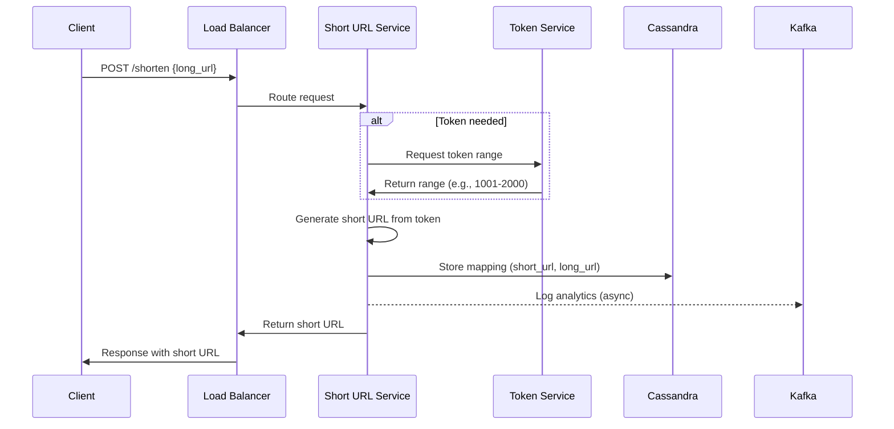
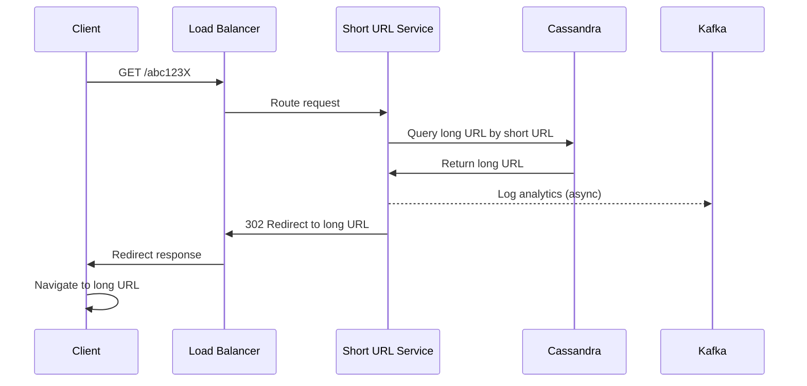
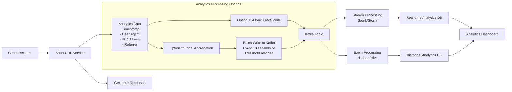
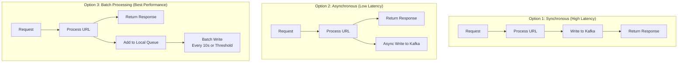
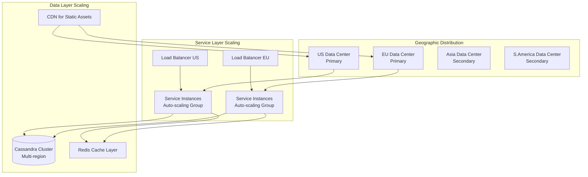
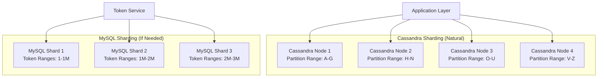
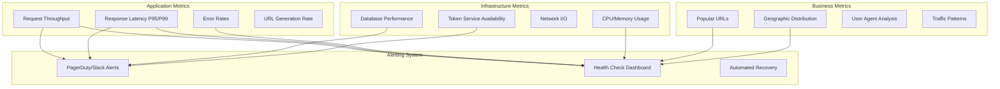

# URL Shortening Service - High Level Design

## Table of Contents
- [Overview](#overview)
- [Requirements](#requirements)
- [System Design](#system-design)
- [Database Design](#database-design)
- [API Design](#api-design)
- [Architecture Components](#architecture-components)
- [Analytics System](#analytics-system)
- [Scalability Considerations](#scalability-considerations)
- [Trade-offs](#trade-offs)

## Overview

This document outlines the high-level design for a URL shortening service similar to TinyURL. The system converts long URLs into shorter, more manageable URLs and provides redirection services.

## Requirements

### Functional Requirements (FRs)
1. **URL Shortening**: Given a long URL, generate and return a shorter URL
2. **URL Redirection**: When a short URL is accessed, redirect users to the original long URL

### Non-Functional Requirements (NFRs)
1. **High Availability**: System must be available 24/7
2. **Low Latency**: Fast response times for both shortening and redirection
3. **Scalability**: Handle millions of requests per day
4. **Durability**: Store URLs for at least 10 years

## System Design

### URL Length Calculation

To determine the appropriate length for short URLs:

```
Total URLs needed = X requests/second × 60 × 60 × 24 × 365 × 10 years = Y

Character set: [a-z, A-Z, 0-9] = 62 characters
URL length needed: n where 62^n ≥ Y
```

**Standard Configuration:**
- **Character Set**: 62 characters (a-z, A-Z, 0-9)
- **URL Length**: 7 characters
- **Capacity**: 62^7 ≈ 3.5 trillion unique URLs

### High-Level Architecture



## Database Design

### URL Storage (Cassandra)
```sql
Table: url_mappings
- short_url (TEXT, Primary Key)
- long_url (TEXT)
- created_at (TIMESTAMP)
- expires_at (TIMESTAMP)
```

### Token Management (MySQL)
```sql
Table: token_ranges
- range_id (INT, Primary Key, Auto Increment)
- start_range (BIGINT)
- end_range (BIGINT)
- assigned (BOOLEAN)
- assigned_to (VARCHAR)
- assigned_at (TIMESTAMP)
```

### URL Shortening Flow



### URL Redirection Flow



### 1. Shorten URL
```http
POST /api/v1/shorten
Content-Type: application/json

{
  "long_url": "https://example.com/very/long/url"
}

Response:
{
  "short_url": "https://short.ly/aBc123X",
  "long_url": "https://example.com/very/long/url",
  "created_at": "2024-01-01T00:00:00Z"
}
```

### 2. Redirect URL
```http
GET /{short_code}

Response: 302 Redirect
Location: https://example.com/very/long/url
```

## Architecture Components

### 1. Short URL Service
- **Responsibilities**:
    - Generate short URLs using token ranges
    - Store URL mappings
    - Handle redirections
- **Scaling**: Multiple instances behind load balancer
- **Technology**: Java/Python with REST API

### 2. Token Service
- **Responsibilities**:
    - Distribute unique number ranges to service instances
    - Ensure no collisions in short URL generation
- **Implementation**: Single-threaded service with MySQL backend
- **Range Distribution**: Allocates ranges (e.g., 1-1000, 1001-2000)

### 3. Load Balancer
- **Function**: Distribute requests across service instances
- **Health Checks**: Monitor service instance availability
- **Technology**: NGINX/HAProxy

### 4. Database Layer
- **Cassandra**:
    - Primary storage for URL mappings
    - Handles high read/write throughput
    - Distributed and fault-tolerant
- **MySQL**:
    - Token range management
    - ACID compliance for range allocation

## Analytics System

### Analytics Data Collection Flow



### Analytics Architecture Options



### Implementation Options

#### Option 1: Asynchronous Kafka Writes
- Write analytics data to Kafka in parallel thread
- **Pros**: Low latency impact
- **Cons**: Potential data loss on failures

#### Option 2: Batch Processing
- Aggregate requests locally in memory
- Flush to Kafka periodically or on threshold
- **Pros**: Better performance, reduced I/O
- **Cons**: Higher potential data loss

### Analytics Data Points
- Request timestamp
- Short URL accessed
- User agent information
- Source IP address (for geographic analysis)
- Referrer information
- Device type

### Processing Pipeline
1. **Stream Processing**: Apache Spark/Storm for real-time analytics
2. **Batch Processing**: Hadoop/Hive for historical analysis
3. **Storage**: Time-series database for metrics
4. **Visualization**: Dashboard for insights

## Scalability Considerations

### System Scaling Strategy



### Database Sharding Strategy



## Trade-offs

### Token Range Approach
**Pros:**
- Eliminates collisions
- Predictable URL generation
- No single point of failure (with multiple token services)

**Cons:**
- Wasted tokens on service restarts
- Additional complexity

### Analytics Implementation
**Trade-off**: Latency vs Data Accuracy
- **Synchronous**: High accuracy, higher latency
- **Asynchronous**: Low latency, potential data loss
- **Batch**: Best performance, highest potential data loss

### Database Choice
**Cassandra vs MySQL:**
- **Cassandra**: Better for high throughput, eventual consistency
- **MySQL**: Better for ACID requirements, complex queries

## Monitoring and Alerting

### Monitoring and System Health



## Security Considerations

### URL Validation
- Validate input URLs for malicious content
- Implement rate limiting per user/IP
- Prevent abuse through monitoring

### Access Control
- API authentication for URL creation
- Admin interface for system management
- Audit logging for compliance

---

*This HLD provides a comprehensive foundation for building a scalable URL shortening service. Implementation details may vary based on specific requirements and constraints.*